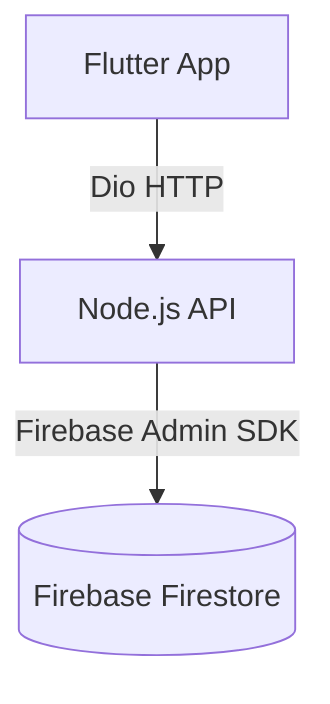

# LingoBreeze

LingoBreeze is a modern, production-quality vocabulary management application built with Flutter and Node.js. It helps users manage and review their personal vocabulary effectively.

## Project Overview

This project implements the "My Vocabulary" feature, allowing users to:
1. View a list of saved vocabulary words.
2. Add new vocabulary words (Word, Meaning, Translation).
3. The app connects to a Node.js API which acts as the intermediary to Firebase Firestore.

## Architecture

The project strictly follows **Clean Architecture** on the Flutter side and uses a layered approach on the Node.js backend.

### Architecture Flow



### Folder Structure

```
lingobreeze/
├── backend/                  # Node.js Express Server
│   ├── package.json
│   ├── server.js
│   └── src/
│       ├── controllers/      # Request handlers
│       ├── firebase/         # Firebase Admin SDK config
│       ├── routes/           # Express routes
│       └── services/         # Business logic & Firestore calls
│
└── lib/                      # Flutter Application
    ├── core/                 # Shared resources
    │   ├── config/           # Environment config (Env)
    │   ├── constants/        # App-wide constants
    │   ├── dependency_injection/ # GetIt Setup
    │   ├── error/            # Exceptions & Failures
    │   ├── network/          # Dio ApiClient setup
    │   ├── theme/            # Material 3 Theme setup
    │   └── widgets/          # Reusable UI components
    │
    ├── features/             
    │   └── vocabulary/       # My Vocabulary Feature
    │       ├── data/         # Models, RemoteDataSource, RepositoryImpl
    │       ├── domain/       # Entities, Repository Contract, UseCases
    │       └── presentation/ # Bloc, Pages, Feature-specific widgets
    │
    └── main.dart             # Entry point
```

## Setup Instructions

### Prerequisites
- [Flutter SDK](https://docs.flutter.dev/get-started/install) (stable)
- [Node.js](https://nodejs.org/) (v16+)
- Firebase Account

### Firebase Setup
1. Create a new project in the [Firebase Console](https://console.firebase.google.com/).
2. Enable **Firestore Database**.
3. Go to **Project Settings** > **Service Accounts** and click **Generate new private key**.
4. Rename the downloaded JSON file to `serviceAccountKey.json`.
5. Place `serviceAccountKey.json` inside the `backend/` directory.

### Backend Setup
1. Open a terminal and navigate to the backend folder:
   ```bash
   cd backend
   ```
2. Install dependencies (you may need to bypass execution policies on Windows if using PowerShell, or use cmd):
   ```bash
   npm install
   ```
3. Start the server:
   ```bash
   npm run dev
   # or
   npm start
   ```
   The server will run on `http://localhost:3000`.

### Flutter App Setup
1. Ensure the Node.js backend is running.
2. In the `lib/core/config/env.dart` file, ensure the `baseUrl` points to your backend. The default is `http://10.0.2.2:3000` which works for Android Emulators connecting to `localhost`. (Use `http://localhost:3000` for iOS simulators or web).
3. Get Flutter dependencies:
   ```bash
   flutter pub get
   ```
4. Run the app:
   ```bash
   flutter run
   ```

## API Documentation

### `GET /words`
Fetches all vocabulary words ordered by creation date (newest first).

**Response (200 OK)**
```json
[
  {
    "id": "docId123",
    "word": "Apple",
    "meaning": "A fruit",
    "translation": "Manzana"
  }
]
```

### `POST /words`
Creates a new vocabulary word.

**Request Body**
```json
{
  "word": "Apple",
  "meaning": "A fruit",
  "translation": "Manzana"
}
```

**Response (201 Created)**
```json
{
  "id": "docId124",
  "word": "Apple",
  "meaning": "A fruit",
  "translation": "Manzana"
}
```

## Screenshots
*(Replace with actual screenshots when presenting)*
- Empty State
- Loading State
- Vocabulary List
- Add Word Bottom Sheet

## AI Contribution
- **UI:** 90% (Generated clean, separated Material 3 widgets matching requested specifications)
- **Backend:** 90% (Generated Express server with Firebase Admin integration)
- **Architecture:** 95% (Fully structured Clean Architecture, BLoC, and DI setup)
